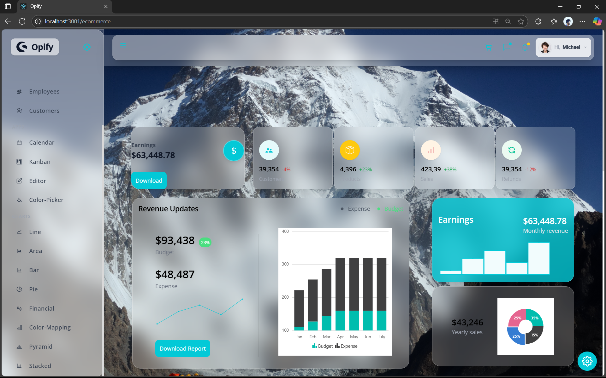

# Opify - Glassmorphism Admin Dashboard

## ✨ Modern, Beautiful React Admin Dashboard

Opify is a cutting-edge admin dashboard featuring:
- Universal glassmorphism design (frosted glass, blur, and transparency)
- Stunning mountain background for a premium look
- Customizable themes and accent colors
- Responsive sidebar and navbar
- Interactive tables, charts, Kanban board, calendar, and more
- Built with React, Tailwind CSS, and Syncfusion components

## 🚀 Features
- **Glassmorphism UI**: Every panel, card, and table uses a frosted glass effect
- **Live Theme Customization**: Switch between light/dark and accent colors
- **Charts & Analytics**: Line, bar, pie, and more
- **Kanban Board**: Drag-and-drop task management
- **Calendar**: Schedule and manage events
- **Responsive Design**: Works on all devices

## 📸 Preview
See the screenshot above for a preview of the Opify dashboard in action!

## Getting Started
1. Clone the repo
2. Install dependencies: `npm install`
3. Start the app: `npm start`

---

© 2025 Opify. All rights reserved.
